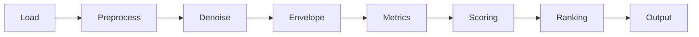
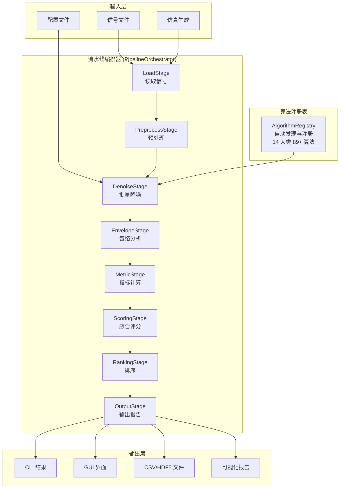

# 滤波基石系统 (Filtering Benchmark System)

> 旋转机械振动/声学信号滤波降噪算法全面评估与对比系统

   [](https://github.com/timeline888/filtering-benchmark)

---

## 📖 项目简介

**滤波基石系统** 是一个面向旋转机械故障诊断领域的信号滤波降噪算法评估与对比系统。系统参考多本滤波算法专著，集成了 **89 种以上** 主流滤波降噪算法，覆盖从经典滤波到深度学习、从时频分析到稀疏表示的完整算法谱系。

系统提供 **统一算法接口、自动化评估流水线、多维指标评价、综合评分排名** 等完整能力，帮助研究人员和工程师快速对比不同算法在振动/声学信号上的降噪效果，为工程选型和研究验证提供数据支撑。

---

## 🌟 核心特性

### 🧩 全面算法库（14 大类 89+ 算法）

| 分类 | 覆盖算法 |
|------|---------|
| **经典滤波** | 低通/高通/带通 Butterworth、FIR/IIR 带通滤波器 |
| **时域降噪** | 移动平均、中值滤波、自适应中值、加权移动平均、Savitzky-Golay、EWMA、高斯滤波 |
| **频域降噪** | FFT 理想低通、谱减法、多带谱减法 |
| **小波变换** | DWT 阈值去噪、小波包去噪 |
| **EMD 类** | EMD、EEMD、CEEMDAN、VMD、LMD、ITD、ALIF、ICEEMDAN |
| **自适应滤波** | LMS、RLS、归一化 LMS、Kalman 滤波 |
| **SVD 类** | SVD 去噪、Hankel SVD |
| **稀疏表示** | 基追踪去噪、OMP、ISTA、ADMM-L1 |
| **盲源分离** | ICA、FastICA、SOBI、JADE |
| **深度学习** | DnCNN、UNet、GAN、DRSN、TCN-LSTM、Transformer、DAE、CDAE |
| **旋转机械专用** | MED 去噪、MCKD、谱峭度、自相关增强 |
| **语音/声学** | 维纳滤波、谱减法增强 |
| **前沿方法** | 非局部均值去噪、随机共振、图信号去噪、分形去噪 |
| **优化算法** | 贝叶斯优化、进化优化、梯度优化、参数联合优化 |

> 📌 算法清单与复杂度分析详见 [滤波基石系统算法参考书](./滤波基石系统算法参考书.md)

### 🔧 完整评估流水线

系统采用 **8 阶段流水线 (Pipeline)** 架构，端到端完成评估全流程：



| 阶段 | 功能 |
|------|------|
| **LoadStage** | 从 CSV/MAT/TDMS/UFF/WAV/HDF5/TXT 格式读取信号 |
| **PreprocessStage** | 去直流、重采样、归一化、分段 |
| **DenoiseStage** | 批量执行所有选中算法的降噪 |
| **EnvelopeStage** | Hilbert 变换 + 包络谱 + 故障频率匹配 |
| **MetricStage** | 20+ 评估指标计算 |
| **ScoringStage** | 多指标归一化与综合评分 |
| **RankingStage** | 算法排序与 TOP-N 输出 |
| **OutputStage** | 结果导出（CSV/HDF5）与报告生成 |

### 📊 多维评估指标

系统内置 **20 余种** 评估指标，覆盖：

- **故障特征指标**：FFR（故障特征比）、HER（谐波能量占比）、ESE（包络谱熵）
- **信噪比指标**：LSNR（局部信噪比）、SI（冲击性指标）
- **统计指标**：峭度 (Kurtosis)、偏度 (Skewness)、峰值因子 (CF)、脉冲因子 (IF)
- **谱域指标**：包络谱峰度 (ESK)、谱峭度 (SK)
- **效率指标**：执行时间

### 🎯 综合评分方法

| 方法 | 说明 |
|------|------|
| **加权和 (Weighted Sum)** | 多指标加权综合评分 |
| **TOPSIS** | 多准则决策（逼近理想解排序） |
| **Borda Count** | 投票排序 |
| **Pareto 前沿** | 多目标帕累托分析 |

### 🖥️ 图形界面 (GUI)

基于 PyQt6 构建的桌面图形界面，提供：

- 信号加载与可视化（时域/频域/包络谱）
- 算法选择与参数配置
- 降噪结果实时预览波形
- 算法排名对比柱状图
- 评估报告查看

### ⚡ 资源控制

- 算法复杂度量化分析（时间/空间复杂度）
- 自动超时保护（低/中/高三档）
- 进程优先级调节（Windows/Linux）
- 大信号安全上限检查

---

## 🚀 快速安装

### 环境要求

- Python ≥ 3.11
- 推荐使用 conda 或 virtualenv 创建独立环境

### 安装方式

```bash
# 克隆仓库
git clone https://github.com/timeline888/filtering-benchmark.git
cd filtering-benchmark

# 安装核心依赖
pip install -e .

# 安装全部依赖（推荐）
pip install -e ".[full]"

# 按需安装模块
pip install -e ".[deep]"      # 深度学习（PyTorch）
pip install -e ".[report]"    # 可视化与报告
pip install -e ".[parallel]"  # 并行计算（Ray、Joblib）
pip install -e ".[dev]"       # 开发测试环境
```

---

## 📋 使用指南

### 🔹 命令行 (CLI)

```bash
# 查看帮助
filter-bench --help

# 列出所有可用算法
filter-bench list-algorithms

# 按类别过滤算法
filter-bench list-algorithms --category classical

# 运行完整评估（使用真实信号文件）
filter-bench run --signal path/to/signal.mat --sample-rate 12000

# 使用仿真信号评估
filter-bench run --signal simulate --sample-rate 12000

# 仅评估指定类别算法
filter-bench run --signal simulate --categories classical,time_domain

# 输出 TOP-5 结果
filter-bench run --signal simulate --top-n 5

# 使用配置文件
filter-bench run --config config/project_config.yaml

# 指定输出目录
filter-bench run --signal simulate --output-dir ./my_results

# 生成配置模板
filter-bench init
```

### 🔹 图形界面 (GUI)

```bash
# 启动 GUI
python -m src.gui.app
# 或
filtering-benchmark-gui
```

### 🔹 Python API

```python
from src.algorithms import registry
from src.algorithms.base import BaseAlgorithm

# 获取注册的所有算法
registry.ensure_discovered()
algorithms = registry.list_algorithms()
print(f"已注册 {registry.count()} 种算法")

# 创建算法实例并运行
inst = registry.create_instance("low_pass_butterworth", cutoff_freq=1000, order=4)
result = inst.denoise(signal, sample_rate=12000)

# 使用流水线
from src.config import ConfigLoader
from src.pipeline.orchestrator import PipelineOrchestrator

config = ConfigLoader().load(user_config_path="config.yaml")
pipeline = PipelineOrchestrator(config)
report = pipeline.run()
```

### 🔹 运行测试

```bash
# 运行全部测试
python -m pytest tests/ -v

# 运行算法模块测试
python -m pytest tests/unit/test_algorithms.py -v

# 运行注册表测试
python -m pytest tests/unit/test_registry.py -v

# 运行集成测试
python -m pytest tests/integration/test_pipeline.py -v
```

---

## 📁 项目结构

```
filtering-benchmark/
├── src/                           # 源代码
│   ├── algorithms/                # 滤波降噪算法库
│   │   ├── base.py                #   算法基类与共享工具函数
│   │   ├── registry.py            #   算法注册器（单例）
│   │   ├── decorators.py          #   装饰器（注册/日志/参数校验）
│   │   ├── complexity_analyzer.py #   复杂度量化分析
│   │   ├── classical/             #   经典滤波
│   │   ├── time_domain/           #   时域降噪
│   │   ├── freq_domain/           #   频域降噪
│   │   ├── wavelet/               #   小波变换
│   │   ├── emd_family/            #   经验模态分解
│   │   ├── adaptive/              #   自适应滤波
│   │   ├── svd/                   #   奇异值分解
│   │   ├── sparse/                #   稀疏表示
│   │   ├── bss/                   #   盲源分离
│   │   ├── deep_learning/         #   深度学习
│   │   ├── rotating_specific/     #   旋转机械专用
│   │   ├── acoustic/              #   语音/声学
│   │   ├── advanced/              #   前沿方法
│   │   └── optimization/          #   优化算法
│   ├── cli/                       # 命令行接口
│   │   └── main.py                #   filter-bench CLI 入口
│   ├── config/                    # 配置管理
│   │   ├── loader.py              #   配置加载
│   │   └── schema.py              #   Pydantic 配置模型
│   ├── core/                      # 核心基础设施
│   │   ├── types.py               #   数据类型定义
│   │   ├── constants.py           #   枚举与常量
│   │   ├── exceptions.py          #   异常定义
│   │   └── throttler.py           #   计算资源节流器
│   ├── envelope/                  # 包络谱分析
│   │   └── analyzer.py
│   ├── execution/                 # 并行执行引擎
│   ├── gui/                       # PyQt6 图形界面
│   │   ├── app.py                 #   GUI 入口
│   │   ├── main_window.py         #   主窗口
│   │   ├── widgets/               #   控件（波形显示、参数面板等）
│   │   ├── dialogs/               #   对话框
│   │   ├── models/                #   数据模型
│   │   ├── utils/                 #   工具函数
│   │   └── workers/               #   后台工作线程
│   ├── metrics/                   # 评估指标
│   │   ├── base.py                #   指标基类与注册器
│   │   └── envelope_metrics.py    #   包络域指标
│   ├── output/                    # 输出导出
│   ├── pipeline/                  # 流水线编排
│   │   └── orchestrator.py        #   8 阶段流水线编排器
│   ├── scoring/                   # 评分排序
│   │   ├── ranking.py             #   评分引擎（加权/TOPSIS/Borda/Pareto）
│   │   └── methods/               #   评分方法实现
│   ├── signal_io/                 # 信号文件 I/O
│   │   ├── base_reader.py         #   读取器基类
│   │   ├── reader_factory.py      #   工厂模式
│   │   ├── preprocessor.py        #   信号预处理
│   │   └── readers/               #   各格式读取器实现
│   ├── signal_simulation/         # 信号仿真
│   │   └── simulator.py           #   轴承/齿轮故障仿真
│   ├── storage/                   # 持久化存储
│   └── visualization/             # 可视化与报告
│       ├── plotter.py             #   图表绘制
│       └── reporter.py            #   报告生成
├── config/                        # 默认配置文件
│   ├── env/                       # 环境配置
│   └── default.yaml               # 全局默认配置
├── data/                          # 数据目录
│   ├── raw/                       #   原始信号
│   ├── processed/                 #   处理结果
│   └── reference/                 #   参考信号
├── tests/                         # 测试
│   ├── unit/                      #   单元测试
│   ├── integration/               #   集成测试
│   └── fixtures/                  #   测试夹具
├── scripts/                       # 工具脚本
├── notebooks/                     # Jupyter Notebook
├── results/                       # 评估结果输出
├── models/                        # 预训练模型文件
├── cwru/                          # CWRU 轴承数据
├── pyproject.toml                 # 项目元数据与依赖
└── requirements.txt               # 依赖清单（备选）
```

---

## ⚙️ 配置说明

系统使用 YAML 格式配置文件，支持命令行参数覆盖。

```yaml
# config/default.yaml（节选）
signal:
  source:
    path: ""                     # 信号文件路径
    sample_rate: null            # 采样率
    simulate_reference: false    # 是否自动生成参考信号

algorithms:
  selection:
    mode: "all"                  # all / selected / category
    categories: []               # 类别过滤
    selected_ids: []             # 算法 ID 过滤

metrics:
  enabled: [ffr, lsnr, her, esk, gi]  # 启用指标列表

scoring:
  method: "weighted_sum"         # 评分方法
  top_n: 3                       # TOP-N 输出

execution:
  parallel_backend: "sequential" # 并行后端
  timeout_per_algorithm_sec: 300 # 单算法超时
```

---

## 🧪 测试

```bash
# 单元测试
python -m pytest tests/unit/ -v

# 集成测试（需信号数据）
python -m pytest tests/integration/ -v

# 覆盖率
python -m pytest --cov=src tests/
```

---

## 📚 参考来源

- 旋转机械故障诊断滤波降噪算法参考书（滤波基石系统参考手册）
- Randall R.B., *Vibration-based Condition Monitoring*, Wiley, 2011
- 轴承故障特征频率计算标准（SKF 6205/6203/NU205）

---

## 🤝 贡献指南

1. Fork 本仓库
2. 创建特性分支 (`git checkout -b feature/amazing-feature`)
3. 提交更改 (`git commit -m 'Add amazing feature'`)
4. 推送分支 (`git push origin feature/amazing-feature`)
5. 发起 Pull Request

### 新增算法

在对应分类目录下创建模块文件，继承 `BaseAlgorithm` 并使用 `@register_algorithm` 装饰器即可自动注册。

```python
from ..base import BaseAlgorithm
from ..decorators import register_algorithm
from ...core.types import AlgorithmCategory, AlgorithmComplexity

@register_algorithm
class MyNewFilter(BaseAlgorithm):
    name = "我的新滤波器"
    category = AlgorithmCategory.CLASSICAL_FILTER
    complexity = AlgorithmComplexity.LOW
    default_params = {"cutoff_freq": 1000}

    def denoise(self, signal, sample_rate, **kwargs):
        # 实现降噪逻辑
        return denoised_signal
```

---

## 📄 许可证

MIT License © 2024 Filtering Benchmark Team

---

## 🏗️ 系统架构图


